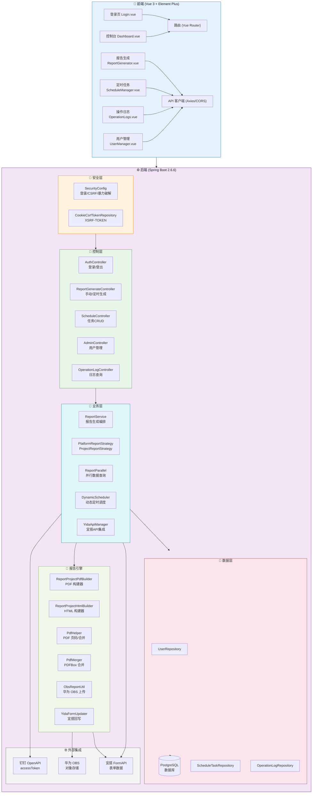

# 运营报告系统

基于 **Spring Boot + Vue 3** 的自动化运营报告生成平台，支持从宜搭（YiDa）表单自动拉取数据，生成 PDF/HTML 运营报告，上传至华为 OBS 并回写宜搭记录。内置定时调度、操作日志审计、管理员后台等功能。

## 📋 项目概览

```
运营报告系统
├── report-springboot/                 # Spring Boot 后端 (Java 17)
│   ├── src/main/java/com/alibaba/work/faas/
│   │   ├── config/                    # 安全配置、CORS、CSRF、数据初始化
│   │   ├── controller/                # REST API 控制器
│   │   ├── model/entity/              # JPA 实体模型
│   │   ├── report/                    # 报告生成核心
│   │   │   ├── async/                 # OBS 上传、宜搭回写
│   │   │   ├── model/                 # 时间范围、报告模型
│   │   │   └── strategy/              # 平台/项目报告策略
│   │   ├── repository/                # JPA 数据访问层
│   │   ├── schedule/                  # 动态定时调度器
│   │   ├── service/                   # 业务逻辑层
│   │   └── util/                      # 工具类
│   └── frontend/                      # Vue 3 前端
│       └── src/
│           ├── api/                   # Axios API 客户端
│           ├── components/            # 可复用组件
│           ├── router/               # Vue Router 路由
│           ├── utils/                # 工具函数
│           └── views/                # 页面视图
├── report-deploy/                     # Docker 部署配置
│   ├── docker-compose.yml             # Docker 编排（DB + Backend）
│   ├── Dockerfile.backend             # 后端容器镜像
│   ├── deploy.sh                      # 部署脚本（参考用）
│   ├── nginx-subpath.conf             # Nginx 子路径配置（参考用）
│   └── .env                           # 生产环境变量模板
└── report-springboot-1.0.0.jar         # 预编译 JAR（本地打包）
```

## 🏗️ 系统架构图



## 🔄 数据流说明

```
报告生成流程：
1. 用户访问登录页面 → 输入管理员密码
2. 前端调用 /api/admin/login → 服务端 session 认证
3. 用户选择报告类型（周报/月报/季报）→ 点击生成
4. 后端从宜搭表单拉取项目列表和源数据（并行查询）
5. 平台报告策略 + 项目报告策略分别生成 HTML
6. OpenHTMLToPDF 渲染 HTML → PDF
7. PDFBox 提取页码标记 → 重新渲染注入正确页码
8. PDFBox 合并平台报告（前 2 页）与项目报告
9. 上传 PDF 到华为 OBS
10. 通过宜搭 OpenAPI 回写附件记录
11. 定时任务：DynamicScheduler 按 cron 自动触发生成
```

## ✨ 功能特性

- **📊 报告生成** — 支持周报/月报/季报，自动从宜搭拉取数据生成 PDF/HTML
- **📑 专业排版** — 封面页 + 目录超链接 + 项目独立页码（1/N）
- **⏰ 动态调度** — 运行时新增/修改/启停/删除定时任务，支持自定义 Cron
- **📈 多时间范围** — 当日/昨日/本周/上周/本月/上月/本季度/上季度
- **☁️ 华为 OBS** — PDF 自动上传对象存储，自定义域名预览
- **📝 宜搭集成** — 自动创建并回写运营报告记录到宜搭表单
- **🔐 登录安全** — 登录失败锁定（5 次/30 分钟）、CSRF 保护（XSRF-TOKEN）
- **🛡️ CSRF 保护** — CookieCsrfTokenRepository + 前端自动附加 X-XSRF-TOKEN 头
- **📋 操作审计** — 记录用户关键操作，支持多条件筛选查询
- **⚡ 并行查询** — 多数据源并行拉取，大幅缩短报告生成时间
- **🔄 定时同步** — 启动时自动恢复数据库中的定时任务配置
- **📱 管理后台** — 控制台、报告生成、定时任务、用户管理、操作日志
- **🧩 策略模式** — 平台报告 / 项目报告策略分离，易于扩展
- **🔧 构造器注入** — 全线使用构造器注入，消除 @Autowired 循环依赖风险

## 🚀 快速启动

### 环境要求

- **JDK 17+**
- **Node.js 18+**
- **Maven 3.8+**
- **Docker + Docker Compose**（生产部署）
- **PostgreSQL 15**（Docker 自动拉取）

### 开发环境启动

```bash
# 1. 配置敏感信息
cp report-springboot/src/main/resources/yida-secret.properties.template \
   report-springboot/src/main/resources/yida-secret.properties
# 编辑填入 钉钉凭证 + OBS 凭证

# 2. 启动后端
cd report-springboot
mvn clean install -DskipTests
mvn spring-boot:run -Dspring-boot.run.profiles=dev
# 服务启动在 http://localhost:8080

# 3. 运行后端测试
mvn test

# 4. 启动前端（新开终端）
cd frontend
npm install
npm run dev
# 开发服务器启动在 http://localhost:5173
```

### 🐳 生产部署（Docker + 宝塔面板）

**架构**：BT Nginx 提供前端静态文件 + 反向代理，Docker 运行后端 + PostgreSQL。

```
BT Nginx (80/443)
  ├── /report/ → 前端静态文件
  └── /report/api/* → 反向代理 → backend (127.0.0.1:8082)
```

**① 部署后端服务：**

```bash
# 上传 report-deploy.tar.gz 到服务器 /opt/report/
cd /opt/report
rm -rf frontend/ report-springboot-1.0.0.jar
tar xzf report-deploy.tar.gz

# 编辑 .env 填入真实凭证（钉钉/宜搭）
vi .env

# 启动后端
docker compose down
docker compose up -d --build
```

> ⚠️ 修改 `.env` 后必须 `down` 再 `up -d`，`restart` 不会重新读取环境变量。

**② 部署前端文件：**

```bash
cp -rf frontend/* /www/wwwroot/realtimevideo.jgjl.cn/report/
```

宝塔面板 → 网站 → 清空缓存。

**③ 验证部署：**

```bash
# 检查后端
curl -s http://localhost:8082/report/api/test

# 检查时区
docker exec report-backend date

# 浏览器访问
# https://realtimevideo.jgjl.cn/report/ → 登录页
```

### 默认账户

| 用户名 | 密码 | 说明 |
|--------|------|------|
| admin | 由 `REPORT_ADMIN_PASSWORD` 环境变量指定 | 管理员 |

### 配置说明

#### 敏感配置（不提交到 Git）

`yida-secret.properties`（已加入 `.gitignore`）：

```properties
# 钉钉企业内部应用凭证
dingtalk.app.key=your-app-key
dingtalk.app.secret=your-app-secret

# 宜搭生产系统配置
yida.production.app.type=your-app-type
yida.production.system.token=your-system-token
yida.production.user.id=your-user-id

# 华为 OBS 凭证
obs.access.key=your-access-key
obs.secret.key=your-secret-key
obs.bucket.name=your-bucket-name
```

#### 环境变量（运行时配置，.env 文件）

| 变量名 | 必填 | 说明 |
|--------|------|------|
| `REPORT_ADMIN_PASSWORD` | ✅ | 管理员登录密码 |
| `DB_PASSWORD` | ✅ | PostgreSQL 密码 |
| `dingtalk.app.key` | ✅ | 钉钉 AppKey |
| `dingtalk.app.secret` | ✅ | 钉钉 AppSecret |
| `yida.*` | ✅ | 宜搭配置（4 项） |
| `SESSION_TIMEOUT` | ❌ | Session 超时（默认 30m） |
| `CORS_ALLOWED_ORIGINS` | ❌ | 跨域白名单 |

## 📦 技术栈

| 层级 | 技术 | 版本 |
|------|------|------|
| **前端框架** | Vue 3 | ^3.4.0 |
| **UI 组件库** | Element Plus | ^2.8.0 |
| **构建工具** | Vite | ^6.4.3 |
| **路由** | Vue Router | ^4.x |
| **HTTP 客户端** | Axios | ^1.x |
| **后端框架** | Spring Boot | 2.6.6 |
| **安全框架** | Spring Security | 2.6.6 |
| **ORM** | Spring Data JPA | 2.6.6 |
| **数据库** | PostgreSQL 15 / H2 | - |
| **PDF 生成** | OpenHTMLToPDF + PDFBox | - |
| **对象存储** |华为云 OBS SDK | 3.22.12 |
| **宜搭 API** | DingTalk SDK | - |
| **部署** | Docker Compose | - |

## 🔐 安全架构

- **Session 认证** — 基于服务端 Session，配置合理的超时时间（默认 30m）
- **CSRF 保护** — CookieCsrfTokenRepository + 前端 `X-XSRF-TOKEN` 请求头
- **BCrypt 密码加密** — Spring Security 默认强度
- **登录失败锁定** — 5 次连续失败锁定 30 分钟（IP+用户名联合键）
- **CORS 白名单** — 仅允许配置的域名跨域访问
- **统一异常处理** — `@ControllerAdvice` 全局异常拦截，不暴露内部错误细节
- **凭证隔离** — 敏感凭证在 `yida-secret.properties`（`.gitignore` 保护），不随代码提交
- **参数校验** — 请求参数统一校验，防止 XSS 注入
- **管理员路由保护** — 所有管理接口需 ADMIN 角色

## 🔧 常见问题

| 问题 | 原因 | 解决 |
|------|------|------|
| 登录返回 403 | CSRF Token 未携带 | 检查前端 `api.js` 是否正确附加 `X-XSRF-TOKEN` |
| OBS 上传 403 | 凭证配置错误 | 检查 `yida-secret.properties` 的 OBS 密钥 |
| 定时任务未触发 | Docker 时区问题 | 检查 `docker exec report-backend date` 是否为 CST |
| 报告显示 NaNKB | `pdfSize` 未回传 | 确认后端已打 NaNKB 修复补丁 |
| 修改配置后无效 | `restart` 不重读 `.env` | 必须 `down` 再 `up -d` |

## 📝 许可证

MIT License

Copyright (c) 2026
